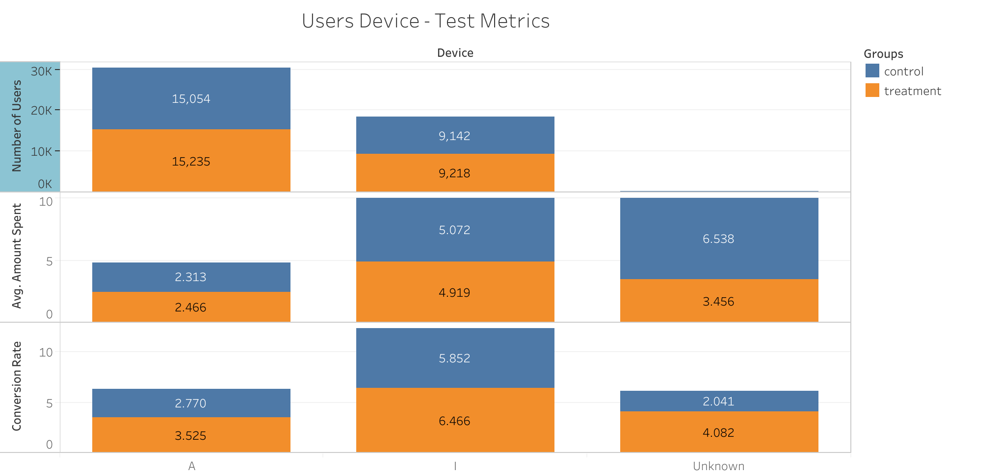

# GloBox Food & Drinks Banner A/B Test Analysis

  By: Preethi Philip


## Purpose

The purpose of this project was to examine the A/B test results of a company GloBox, and provide recommendations to stakeholders on whether the experiment should be launched or not.

## Context

GloBox is primarily known amongst its customer base for boutique fashion items and high-end decor products. However, their food and drink offerings have grown tremendously in the last few months, and the company wants to bring awareness to this product category to increase revenue.

The Growth team decided to run an A/B test that highlights key products in the food and drink category as a banner at the top of the website. The control group does not see the banner, and the test group sees it as shown below:


## Hypotheses

#### Conversion Rate:

- **NULL:** No observable difference in conversion rates between control and treatment groups.
- **ALTERNATIVE:** A differential conversion rate exists between the two groups.

#### Average Amount spent per user:

- **NULL:** There is no difference in the average amount spent by the user across two groups.

- **ALTERNATIVE:** There is a difference in average expenditure between the two groups.

## Methodology

### Test Design

  A user visits the GloBox main page and is randomly assigned to either the control or test group. This is the join date for the user.The page loads the banner if the user is assigned to the test group, and does not load the banner if the user is assigned to the control group

- **Population:**

    There were 48,943 total users in the A/B test with 24,343 in the Control group and 24,600 in the Test group.
- **Duration:**

    The experiment is being run only for 13 days, from 25th January 2023 to 6th February 2023, on the mobile website.

- **Success Metrics**

    Hypothesis testing was done on the two key metrics - conversion rate and the average amount spent per user. Confidence intervals were also calculated.

## Results

### Data Analysis
- **Pre-Processing Steps:** As a first step, I uploaded the database file into Beekeeper Studio and started exploring the data. To provide concrete insights, I crafted a SQL query that extracted crucial information:
As part of data cleaning addressed null values in SQL, replacing them with ‘Unknown’.

   The first query is for obtaining the final analysis dataset

 ```
 SELECT
 u.id,
 COALESCE (u.country, 'Unknown') AS country,
 COALESCE (u.gender, 'Unknown') AS gender,
 COALESCE (g.device, 'Unknown') AS device,
 g.group AS test_group,

 SUM(COALESCE(a.spent, 0)) amount_spent,
 CASE WHEN SUM(COALESCE(a.spent, 0)) > 0 THEN 1
 ELSE 0
 END AS converted_or_not

 FROM users u
 INNER JOIN groups g
 ON (u.id=g.uid)
 LEFT JOIN activity a
 ON (u.id=a.uid)
 GROUP BY u.id,
 u.country,
 u.gender,
 g.device,
 test_group
```

 The second query is for advanced task.

```
   WITH cte_conversion AS
   (
       SELECT g.uid,
       min(dt) AS purchase_date,
       SUM(COALESCE(spent, 0)) AS spend,
       CASE WHEN SUM(COALESCE(a.spent, 0)) > 0 THEN 1
       ELSE 0
       END AS converted_or_not
       FROM groups g
       LEFT JOIN activity a
       ON g.uid = a.uid
       GROUP BY g.uid
   )

   SELECT c.uid,
   join_dt,
   purchase_date,
   COALESCE (u.country, 'Unknown') AS country,
   COALESCE (u.gender, 'Unknown') AS gender,
   COALESCE (g.device, 'Unknown') AS device, g.group, c.spend, c.converted_or_not
   FROM cte_conversion c
   LEFT JOIN groups g
   ON c.uid = g.uid
   LEFT JOIN users u
   ON c.uid = u.id
  ```

- **Statistical Tests Used:**

    Created a CSV file from the cleaned data in the database.The CSV file was imported into Spreadsheet for primary statistical analysis. Hypothesis testing was done on the two key metrics - conversion rate and the average amount spent per user.

    Hypothesis test for conversion rate was done using a two-sample z-test and Hypothesis test for Average Amount Spent per User was done using a two-sample t-test.

- **Results Overview:**

    There were 48,943 total users in the A/B test with 24,343 in the Control group and 24,600 in the Test group. There was a conversion rate of 3.923% in the Control group and a conversion rate of 4.630% in the Treatment group. The average spent in the Control group was $3.375 and was $3.391 in the Treatment group.

    This difference in conversion rate is statistically significant, but not in average spending, as will be shown in the following sections.


  1.**Exploratory Data Analysis**

   - **Conversion Rate And Average Amount Spent**

    

    There were 48,943 total users in the A/B test with 24,343 in the Control group and 24,600 in the Test group. There was a conversion rate of 3.923% in the Control group and a conversion rate of 4.630% in the Treatment group. The average spent in the Control group was $3.375 and was $3.391 in the Treatment group.

   -  **Spending Distribution**

    

    The majority of purchases were between 30-60 USD for both groups, and the majority were below 150 USD.

   - **User's Device**

    

    There were more Android users than iOS. iOS users had the highest overall conversion rate of 6.5%.

    Overall average spending was 5 USD for iOS users in the Control group, but it was lesser in the Treatment group.

   - **Gender**

    

    The analysis by gender shows the following results:
    For females, the conversion rate in the test group (5.44%) was slightly higher than in the control group (5.14%), and the average amount spent was slightly lower in the test group ($4.13) compared to the control group ($4.46).
    For males, the conversion rate in the test group (3.79%) was higher than in the control group (2.63%), and the average amount spent was also higher in the test group ($2.60) compared to the control group ($2.25).


   - **User's Country**

    


    USA has the highest number of users and the second-highest overall conversion rate. While Canada seems to have the highest overall conversion rate, it is important to note that the sample size of Canadian users was quite small.  Australia as well which has the lowest conversion rates. Mexico shows the highest increase in conversion in the treatment group compared to control and Turkey is the only country to have a decreased conversion rate in the treatment.

 2. **Hypothesis Testing**


  - **Conversion Rate:**

    To check if there is a statistically significant difference in the conversion rate of the two groups.

    H0: pB = pA  (The conversion rates in the control and treatment groups are equal)

    H0: pB != pA(The conversion rates in the control and treatment groups are not equal)

     Where
     B = treatment
     A = control

     α = 0.05

    **Two-sample z-test with pooled proportion**		

    Control Group: 24,343 users and 0.03923099043 conversion rate.

    Treatment Group: 24,600 users and 0.04630081301 conversion rate.

    p^ = (0.0392*24343 + 0.0463*24600) / (24343+24600) = 0.0428

    Standard Error: √(0.0428* (1-0.0428) * (1 / 24343 + 1 / 24600) = 0.0018

    Test Statistic: (0.0392 - 0.0463) / 0.0018 = 3.8643

    P-Value: 2 * (1 – NORM.S.DIST(3.8643)) = 0.000111

    Since P is less than α we reject the null hypothesis, there is a statistically significant difference in the conversion rate between the groups.

    **95% Confidence Interval for Conversion Rate**

    sample statistic = 0.0463 - 0.0392 = 0.0071

    critical value: NORMSINV(1-(0.05/2)) = 1.96

    Standard error =  √((0.0392 * (1 – 0.0392) / 24343) + (0.0463 * (1 – 0.0463) / 24600)) = 0.0018

    Margin of error : 1.96 * 0.001828488 = 0.00358

    Lower Bound: 0.0071 – 0.00358 = 0.0035

    Upper Bound: 0.0071 + 0.00358= 0.0107

    The 95% confidence interval for the difference in the conversion rate between the treatment and control groups (treatment - control) is approximately [0.0035, 0.0107].

    

    The chart shows the average conversion rate for the groups, along with a range above and below that average. This range is called an “error bar”.

    **Average Amount Spent per User:**

    To check if there is a statistically significant difference in the average spend between the two groups.

    H0: μA = μB (The average amount spent per user in the control and treatment groups is equal)

    H0: μA ≠ μB (The average amount spent per user in the control and treatment groups is not equal)
    α = 0.05

    **Two-sample t-interval with unpooled variance**

    Control Group average spent is 3.3745 with a Standard Deviation of 25.93639056

    Treatment Group average spent is 3.3909 with a Standard Deviation of 25.4141096.

    Standard Error: √((25.93639056^2/ 24343) + (25.4141096^2 / 24600)) = 0.2321406

    Test statistic: (3.3909-3.3745) /  0.2321406 = 0.0704249

    T-Test p-value: 0.943856 (Using T.TEST() function in Spreadsheet)

    Since this P-value is greater than α we fail to reject the null hypothesis. This means that there is not a statistically significant difference in the average amount spent between the two groups.

    **95% Confidence Interval for Average amount spent per user**

    degrees of freedom : Min(24600 - 1, 24343 - 1) = 24342

    critical value: TINV(0.05,24342) = 1.9601

    margin of error:  1.9601 * 0.2321406 = 0.45501

    sample statistic:   3.3909 - 3.3745 = 0.01635

    Lower Bound:0.01635 - 0.45501 = -0.439

    Upper Bound:0.01635 + 0.45501 =  0.471

    The 95% confidence interval for the difference in the average spent between the treatment and control groups (treatment - control) is approximately [-0.439, 0.471].

    

    **Novelty Effects**

     > Novelty effects refer to initial, short-term trends that occur when users exhibit when they encounter something new and unfamiliar. These effects are typically characterized by increased attention, engagement, and interest in the novel element, but they may not necessarily reflect the long-term or sustained impact on user behaviour or preferences.

      After observing a significant difference in the conversion rates between the control and test groups, we conducted a Novelty Effect Test. Novelty refers to an individual's tendency to respond more positively to new experiences, objects, or information than to familiar ones.

      

      In the context of an A/B test, this could mean that users might change their behavior just because something is new, not necessarily better. Therefore, it's important to check if the observed effect was due to the novelty of the change.A general downward trend was observed in this test of daily visitors.  

      

      The plot showed that the conversion rate for the treatment group was consistently higher than the control group throughout the test period. This consistent difference further supports the conclusion that the new banner had a positive impact on the conversion rate.

      **Power Analysis**

      A power analysis helps us understand the necessary sample size in order to achieve our desired minimum detectable effect and statistical power.

      The effect size analysis through Cohen’s coefficient indicates that a bigger sample size might be required for sufficient statistical sensitivity.

      There is no standard Minimum Detectable Effect (MDE) as it depends on the context. For this calculation, 10% is used as it seems to be the general default value (Masterschool). 


      Baseline conversion rate (p1) = 3.92%

     Minimum detectable effect (d) = 10%

    A/B Split Ratio = 0.5

    significance level (α) = 0.05

    Statistical Power (1 - β) = 0.8

    In order to have sufficient power for the conversion rate test, the sample size would have to be 77k users split evenly between the two groups. The result was calculated using the Statsig Sample size calculator.

    ## Conclusions

  - **Key Takeaways:**

    In comparing the control and treatment groups, we found.
    1. User conversion rates increased significantly after seeing the banner.

    2. In terms of revenue, there was no significant difference
    3. Men and Android users converted the most.
    4. Mexico shows the highest increase in conversion in the treatment group compared to control group.
    5. The conversion rate in the treatment  group (5.44%) was slightly higher than in the control group (5.14%

  - **Limitations/Considerations:**

    1. The limited size of the sample used for the experiment.
    2. The limited test Duration.

    ## Recommendations

    - **Next Steps:**

        Launching and maintaining the new banner shouldn't pose significant challenges, especially considering the observed higher conversion rate, even if the average revenue per user remains constant. Thus, I recommended implementing the new banner for all users based on these insights.

    - **Further Analysis:**

    1. Increasing the duration of the experiment will allow us to better understand the banner's long-term impact.
    2. This extension will allow us to observe trends beyond the initial novelty phase and determine if the improvements in conversion rates and revenue are sustained over time.
    3. Another consideration is the limited size of the sample used for the experiment. A larger dataset would provide more robust and reliable results.To ensure sufficient power, we require a sample size of at least 77,000 users, divided equally.
    4. Additionally, the experiment's design should consider the type of product that users are purchasing.
    5. And also consider the demographic parameters of the users in terms of gender, device and country.
